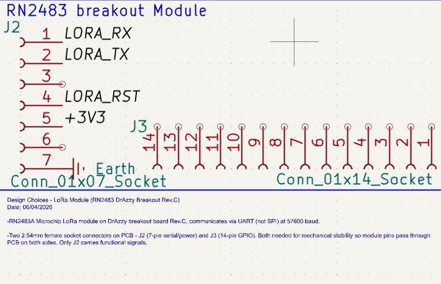
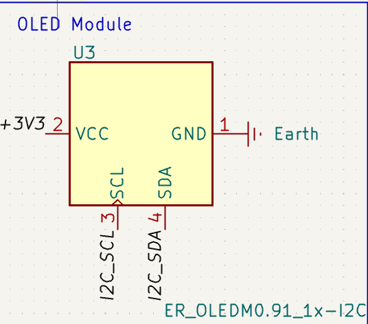

[Repository Root](../../../README.md) > [PCB Overview](../../PCB_OVERVIEW.md) > Communications

# Communications — PCB Documentation
**Last Modified:** 06/04/2026  
**Subsystem:** Communications (LoRa + OLED)  
**Schematic Sheet:** Coms  

---

## Schematics





---

## RN2483 LoRa Module (DrAzzy Breakout Rev.C)

### Component
| Parameter | Value |
|---|---|
| Module | Microchip RN2483A |
| Breakout | DrAzzy/Azduino Rev.C (assembled) |
| Protocol | UART (not SPI) |
| Baud rate | 57600 |
| Frequency | 868MHz (Europe) + 433MHz |
| Supply voltage | 3.3V |
| TX current | ~120mA |
| Antenna | SMA connector (868MHz used) |
| Last Modified | 06/04/2026 |

**Datasheet:** _Insert link here_  
**Breakout product page:** https://www.tindie.com/products/drazzy/lorawan-rn2483rn2903-breakout-board-assembled/

### PCB Connectors

**J2 — Serial/Power (7-pin, functional)**
| Pin | Board Label | Net | ESP32 Connection |
|---|---|---|---|
| 1 | RX | LORA_RX | GPIO16 (UART2 RX) |
| 2 | TX | LORA_TX | GPIO17 (UART2 TX) |
| 3 | CTS | NC | — |
| 4 | RTS | LORA_RST | GPIO14 |
| 5 | 3V3 | +3V3 | Power |
| 6 | VIN | NC | Do not connect |
| 7 | GND | GND | Ground |

⚠️ Do NOT connect VIN — module powered via 3V3 pin directly from AP2112K rail.

**J3 — GPIO Row (14-pin, mechanical only)**
| Pins | Net | Purpose |
|---|---|---|
| All 1–14 | NC | Mechanical support only |

**Footprints:**
```
J2: Connector_PinHeader_2.54mm:PinSocket_1x07_P2.54mm_Vertical
J3: Connector_PinHeader_2.54mm:PinSocket_1x14_P2.54mm_Vertical
```

⚠️ Row spacing between J2 and J3 must match physical DrAzzy board — **measure before PCB layout!**

### Decoupling
| Ref | Value | Placement |
|---|---|---|
| | 100nF ceramic | Between J2 pin5 (+3V3) and GND |

### Antenna Notes
- 868MHz SMA connector used (Europe LoRaWAN band)
- 433MHz SMA left unconnected
- Antenna points toward board edge — maintain clearance from other components
- No traces routed under antenna area

---

## OLED Display (SH1106 0.96")

### Component
| Parameter | Value |
|---|---|
| Part | SH1106 OLED 0.96" |
| Symbol | ER_OLEDOM0.91_1x-I2C |
| Protocol | I2C |
| I2C Address | 0x3C |
| Supply voltage | 3.3V |
| Current | ~10mA |
| Resolution | 128×32 pixels |
| Last Modified | 06/04/2026 |

**Datasheet:** _Insert link here_

### Pin Connections
| Pin | Net | Notes |
|---|---|---|
| VCC (2) | +3V3 | |
| GND (1) | GND | |
| SCL (3) | I2C_SCL | GPIO22 |
| SDA (4) | I2C_SDA | GPIO21 |

### I2C Bus
| Device | Address | Conflict? |
|---|---|---|
| SH1106 OLED | 0x3C | — |

### Decoupling
| Ref | Value | Placement |
|---|---|---|
| | 100nF ceramic | Between VCC and GND on connector |

---

## PCB Layout Notes

- J2 and J3 must be parallel and spaced to match DrAzzy board physical dimensions
- Both connectors are female sockets — module male pins pass through PCB
- Antenna clearance zone: no copper within 5mm of RN2483 antenna area
- OLED connector placed for cable routing toward enclosure front panel cutout

---

## Change Log

| Date | Change |
|---|---|
| 06/04/2026 | Initial LoRa + OLED schematic and documentation |
| 06/04/2026 | Confirmed UART interface, 57600 baud |
| 09/04/2026 | PCB connectors placed |


---

## Related Documents

- [PCB Overview](../../PCB_OVERVIEW.md)
- [Microcontroller Unit](../MCU/MCU.md)
- [Power Management](../POWER/POWER.md)
- [Sensors](../SENSORS/SENSORS.md)
