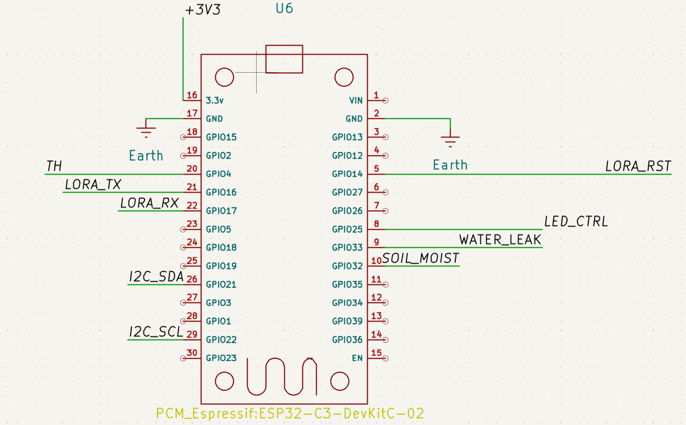

[Repository Root](../../../README.md) > [PCB Overview](../../PCB_OVERVIEW.md) > Microcontroller Unit

# MCU — ESP32 DevKit V1 PCB Documentation
**Last Modified:** 09/04/2026  
**Subsystem:** Microcontroller Unit  
**Schematic Sheet:** ESP32 DevKit V1  

---

## Schematic

---

## Component

| Parameter | Value |
|---|---|
| Part | ESP32 DevKit V1 (DOIT) |
| Module | ESP-WROOM-32 |
| Symbol | DOIT_ESP32_DEVKIT_V1 |
| Footprint | DOIT_ESP32_DEVKIT_V1 (community library) |
| Form factor | 30-pin DIP, 15 pins per side |
| Pin spacing | 2.54mm |
| Row spacing | 22.86mm (0.9 inches) |
| USB | Micro-USB (CP2102 USB-UART) |
| Last Modified | 09/04/2026 |

**Datasheet:** _Insert link here_

---

## Power

| Pin | Net | Notes |
|---|---|---|
| 3V3 (right side pin 15) | +3V3 | Powered from AP2112K rail |
| GND (left pin 13, right pin 6) | GND | Multiple GND pins |
| VIN | NC | Not used — powered via 3V3 |
| EN | NC | Default HIGH (running) |

⚠️ Power via 3V3 pin only — bypasses onboard regulator. Do NOT connect VIN when powering via external 3V3.

---

## GPIO Assignment

### Left Side (top → bottom, antenna side)

| Physical Pin | GPIO | Net Label | Function |
|---|---|---|---|
| 1 | EN | NC | Reset — leave floating |
| 2 | GPIO36 | NC | Input only |
| 3 | GPIO39 | NC | Input only |
| 4 | GPIO34 | LIGHT_SENS | ADC1_CH6 — KY-018 photoresistor analog |
| 5 | GPIO35 | WATER_LEAK | ADC1_CH7 — water leakage digital |
| 6 | GPIO32 | SOIL_MOIST | ADC1_CH4 — soil moisture analog |
| 7 | GPIO33 | NC | Input only |
| 8 | GPIO25 | LED_CTRL | DAC1 — LED control PWM |
| 9 | GPIO26 | NC | |
| 10 | GPIO27 | NC | |
| 11 | GPIO14 | LORA_RST | LoRa module reset |
| 12 | GPIO12 | NC | ⚠️ Boot sensitive |
| 13 | GND | GND | |
| 14 | GPIO13 | NC | |
| 15 | VIN | NC | Do not connect |

### Right Side (top → bottom)

| Physical Pin | GPIO | Net Label | Function |
|---|---|---|---|
| 1 | GPIO23 | NC | |
| 2 | GPIO22 | I2C_SCL | I2C clock — OLED |
| 3 | GPIO1/TX0 | NC | ⚠️ USB serial TX |
| 4 | GPIO3/RX0 | NC | ⚠️ USB serial RX |
| 5 | GPIO21 | I2C_SDA | I2C data — OLED |
| 6 | GND | GND | |
| 7 | GPIO19 | NC | |
| 8 | GPIO18 | NC | |
| 9 | GPIO5 | NC | ⚠️ Boot sensitive |
| 10 | GPIO17 | LORA_TX | UART2 TX → RN2483 RX |
| 11 | GPIO16 | LORA_RX | UART2 RX → RN2483 TX |
| 12 | GPIO4 | TH | DHT22 single-wire data |
| 13 | GPIO2 | NC | ⚠️ Boot sensitive, onboard LED |
| 14 | GPIO15 | NC | ⚠️ Boot sensitive |
| 15 | 3V3 | +3V3 | Power input from AP2112K |

---

## GPIO Usage Summary

| Net | GPIO | Protocol | Peripheral |
|---|---|---|---|
| TH | GPIO4 | Single-wire | DHT22 |
| LORA_RX | GPIO16 | UART2 RX | RN2483 TX |
| LORA_TX | GPIO17 | UART2 TX | RN2483 RX |
| LORA_RST | GPIO14 | Digital OUT | RN2483 RST |
| I2C_SDA | GPIO21 | I2C | OLED |
| I2C_SCL | GPIO22 | I2C | OLED |
| LED_CTRL | GPIO25 | PWM/Digital | LED module |
| WATER_LEAK | GPIO35 | Digital IN | Water sensor DO |
| LIGHT_SENS | GPIO34 | ADC1 | KY-018 photoresistor |
| SOIL_MOIST | GPIO32 | ADC1 | Soil moisture AOUT |

**GPIOs used: 10 / Free: 5**

---

## Decoupling

| Ref | Value | Footprint | Placement |
|---|---|---|---|
| C6 | 100nF ceramic | C_Disc THT | As close as possible to 3V3 pin |

---

## Pins to Avoid

| GPIO | Reason |
|---|---|
| GPIO6–11 | Connected to internal SPI flash — never use |
| GPIO1, GPIO3 | UART0 USB serial — avoid for peripherals |
| GPIO34–39 | Input only, no pullup/pulldown |
| ADC2 pins (0,2,4,12–15,25–27) | Unreliable when LoRa radio active |

---

## PCB Layout Notes

- Footprint: two rows of 15 pins, 2.54mm pitch, 22.86mm row spacing
- USB port must remain accessible from enclosure side
- Antenna area must have clearance — no traces under WROOM-32 module antenna
- C6 decoupling cap placed directly adjacent to 3V3 pin

---

## Change Log

| Date | Change |
|---|---|
| 09/04/2026 | Initial GPIO assignment and documentation |

---

## Related Documents

- [PCB Overview](../../PCB_OVERVIEW.md)
- [Communications](../COMS/COMS.md)
- [Power Management](../POWER/POWER.md)
- [Sensors](../SENSORS/SENSORS.md)
