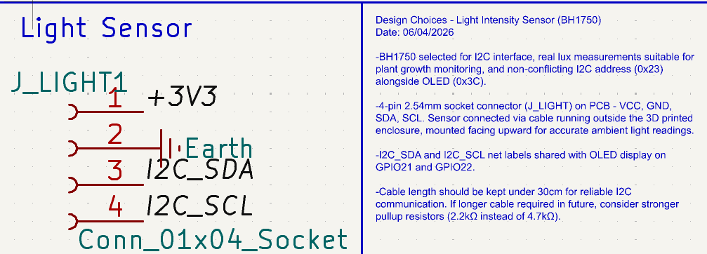

[Repository Root](../../../README.md) > [PCB Overview](../../PCB_OVERVIEW.md) > Sensors

# Sensors — PCB Documentation
**Last Modified:** 07/04/2026  
**Subsystem:** Sensors  
**Schematic Sheet:** Sensores  

---

## Schematics


---

## DHT22 — Temperature and Humidity Sensor

### Component
| Parameter | Value |
|---|---|
| Part | DHT22 (AM2302) |
| Symbol | DHT11 (pin-for-pin compatible) |
| Protocol | Single-wire proprietary |
| Temp range | -40°C to +80°C |
| Temp accuracy | ±0.5°C |
| Humidity range | 0–100% RH |
| Humidity accuracy | ±2–5% RH |
| Supply voltage | 3.3–5V |
| Supply current | 1.5mA max |
| ESP32 pin | GPIO4 |
| Net label | TH |
| Last Modified | 03/04/2026 |

**Datasheet:** (https://www.mouser.com/datasheet/2/737/dht-932870.pdf)

### Schematic Components
| Ref | Value | Footprint | Purpose |
|---|---|---|---|
| U2 | DHT22 | TO-92-3 or compatible | Sensor |
| R2 | 4.7kΩ | R_Axial THT | DATA line pull-up to +3V3 |
| C5 | 100nF | C_Disc THT | VDD decoupling cap |

### Pin Connections
| Pin | Net | Notes |
|---|---|---|
| VDD (1) | +3V3 | |
| DATA (2) | TH → GPIO4 | Via 4.7kΩ pull-up to +3V3 |
| NC (3) | NC | Leave floating |
| GND (4) | GND | |

⚠️ R2 pull-up is mandatory for DHT22 — without it signal floats and readings fail.

### Physical Notes
- Requires airflow — mount near enclosure vent or outside enclosure
- Cable connects sensor to PCB connector
- Keep DATA wire under 20m for reliable signal

---

## Capacitive Soil Moisture Sensor v1.2


### Component
| Parameter | Value |
|---|---|
| Part | Capacitive Soil Moisture Sensor v1.2 |
| Output | Analog (AOUT) |
| Supply voltage | 3.3–5V |
| Output voltage | 0–3.3V (analog) |
| Connector | JST PH 2.0mm 3-pin |
| ESP32 pin | GPIO32 (ADC1_CH4) |
| Net label | SOIL_MOIST |
| Last Modified | 07/04/2026 |

**Datasheet:** (https://www.datocms-assets.com/28969/1662716326-hw-101-hw-moisture-sensor-v1-0.pdf)

### PCB Connector — J_SOIL
| Pin | Net | Notes |
|---|---|---|
| 1 | SOIL_MOIST | AOUT → GPIO32 ADC1 |
| 2 | GND | |
| 3 | +3V3 | |

**Footprint:**
```
J_SOIL: JST_PH_B3B-PH-K_1x03_P2.00mm_Vertical
```
⚠️ JST PH **2.0mm pitch** — NOT standard 2.54mm. Verify footprint before PCB manufacture!

### Why ADC1
ADC1 (GPIO32–GPIO39) remains reliable when LoRa radio is active. ADC2 pins are unreliable during RF transmission.

### Physical Notes
- Sensor probe acts as structural anchor in soil
- Consider mounting angle and cable strain relief in enclosure
- Sensor has onboard filtering — no additional decoupling cap required

### Future Improvement
Low-pass RC filter on AOUT line (10kΩ + 100nF) to reduce high-frequency noise before ADC sampling — not implemented in v1.0.

---

## Water Leakage Sensor


### Component
| Parameter | Value |
|---|---|
| Part | Resistive water leakage sensor |
| Output | Digital (DO) |
| Supply voltage | 3.3–5V |
| Connector | 2.54mm 3-pin |
| ESP32 pin | GPIO35 (ADC1_CH7) |
| Net label | WATER_LEAK |
| Last Modified | 06/04/2026 |

**Datasheet:** (https://www.datasheethub.com/wp-content/uploads/2022/10/42240.pdf)

### PCB Connector — J_WATER
| Pin | Net | Notes |
|---|---|---|
| 1 | +3V3 | |
| 2 | GND | |
| 3 | WATER_LEAK | DO → GPIO35 |

**Footprint:**
```
J_WATER: Connector_PinHeader_2.54mm:PinSocket_1x03_P2.54mm_Vertical
```

### Physical Notes
- Sensor connected via cable from PCB connector
- Sensor itself embedded **inside** 3D printed enclosure
- Placed flat at bottom of enclosure to detect pooling water from rain, irrigation splash, condensation
- Cable length kept short
- Digital output used — HIGH/LOW flood detection sufficient

---

## Light Intensity Sensor (KY-018 Photoresistor)


### Component
| Parameter | Value |
|---|---|
| Part | KY-018 Photoresistor Module |
| Protocol | Analog Output |
| Supply voltage | 3.3–5V |
| ESP32 pin | GPIO34 (ADC1_CH6) |
| Net label | LIGHT_SENS |
| Last Modified | 09/04/2026 |

**Datasheet:** N/A (Standard LDR voltage divider module)

### PCB Connector — J_LIGHT
| Pin | Net | Notes |
|---|---|---|
| 1 | +3V3 | |
| 2 | GND | |
| 3 | LIGHT_SENS | Analog DO → GPIO34 |

**Footprint:**
```
J_LIGHT: Connector_PinHeader_2.54mm:PinSocket_1x03_P2.54mm_Vertical
```

### Analog Output Notes
- Measured using ADC to determine light range
- The KY-018 contains a fixed resistor acting as a voltage divider with the LDR
- Reads 0-4095 on the ESP32 (depending on brightness and 3V3 scaling)

### Physical Notes
- Connected via cable running **outside** 3D enclosure
- Sensor mounted facing upward for accurate ambient sunlight representation

---

## PCB Layout Notes

- All sensor connectors placed on same board edge (bottom) for clean cable management
- J_SOIL uses 2.0mm JST footprint — different from all other 2.54mm connectors
- DHT22 placement near board edge for airflow access
- Water leakage sensor connector near enclosure interior — short cable

---

## Change Log

| Date | Change |
|---|---|
| 03/04/2026 | DHT22 schematic with R2 pullup and C5 decoupling |
| 06/04/2026 | Water leakage, light sensor schematics |
| 07/04/2026 | Soil moisture schematic, JST footprint note |
| 09/04/2026 | PCB connectors placed |


---

## Related Documents

- [PCB Overview](../../PCB_OVERVIEW.md)
- [Communications](../COMS/COMS.md)
- [Microcontroller Unit](../MCU/MCU.md)
- [Power Management](../POWER/POWER.md)
